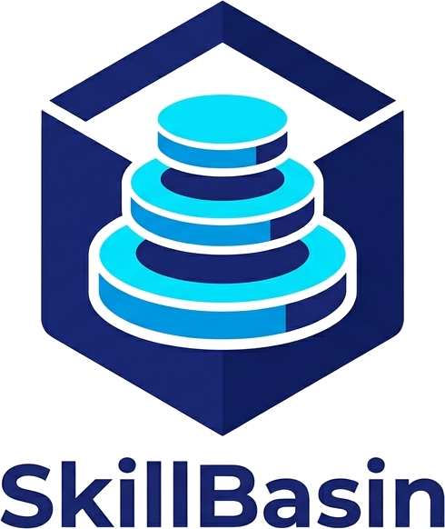
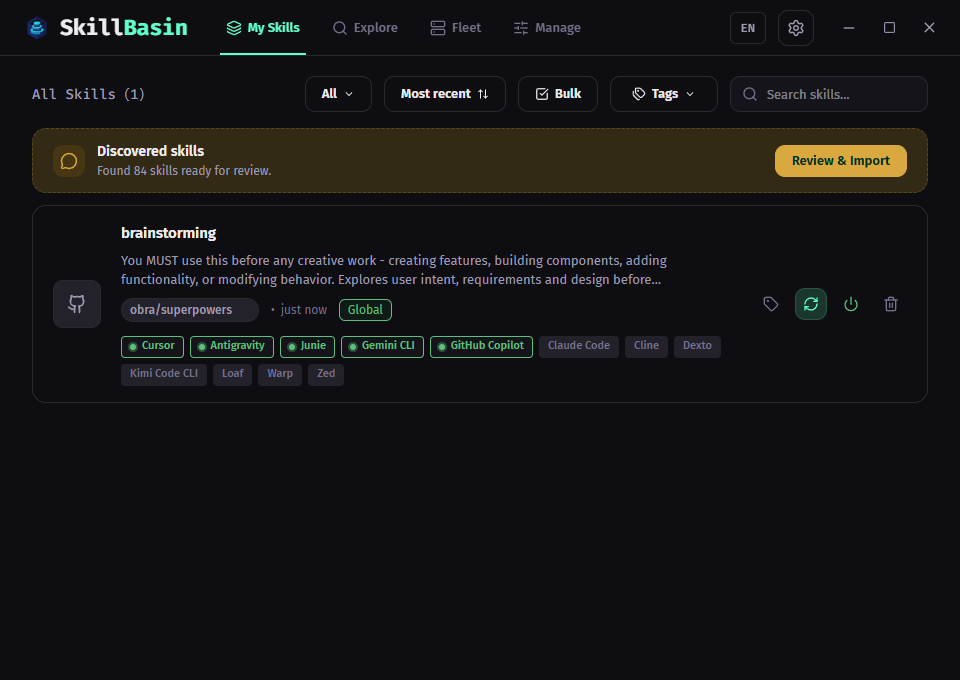
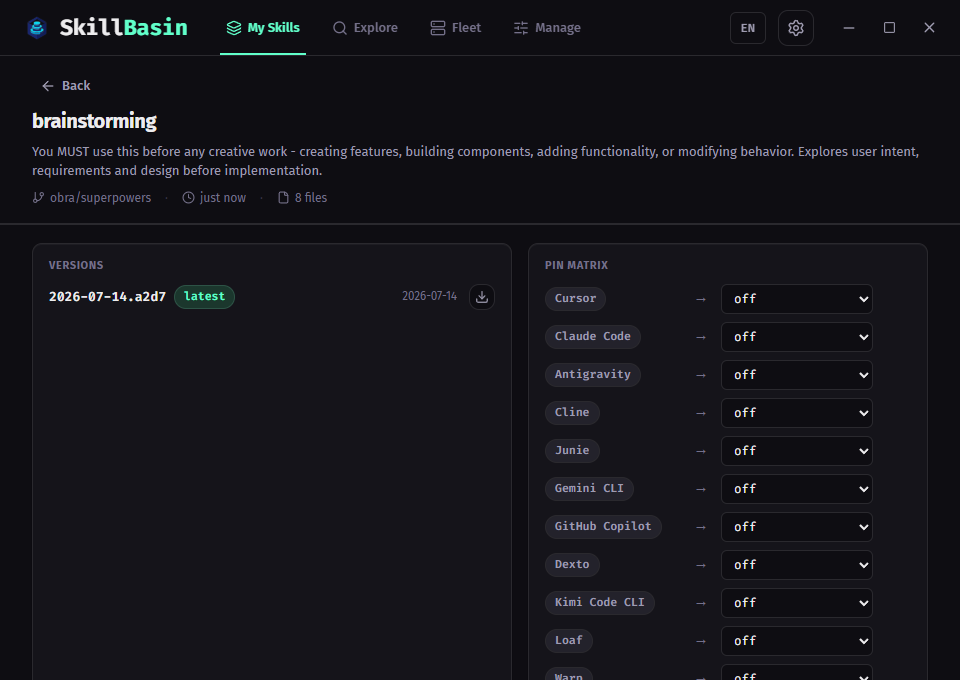
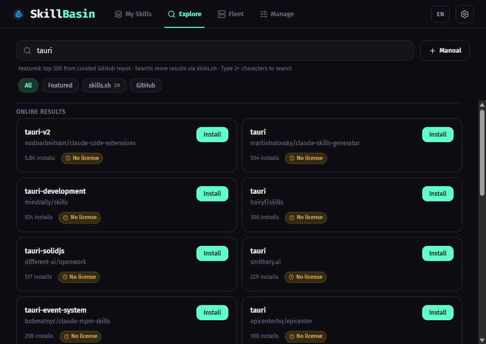
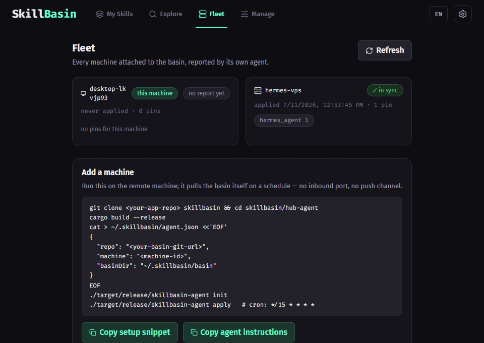
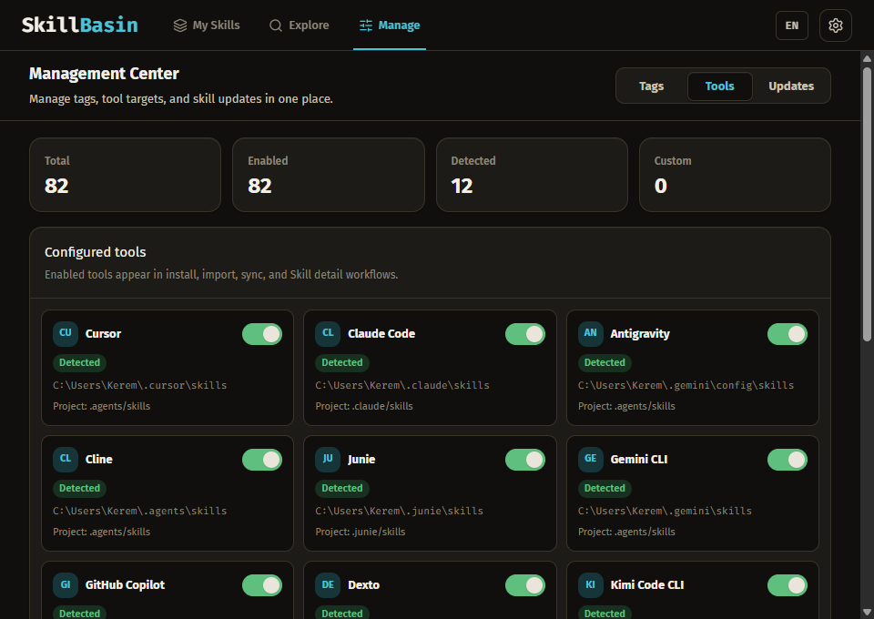
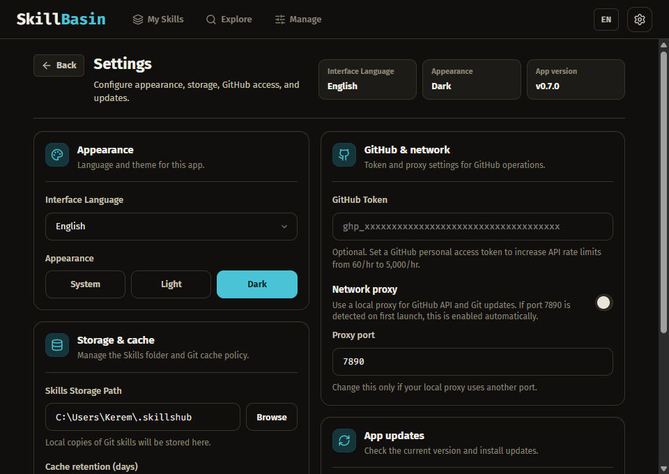

<p align="center">
  
</p>

A desktop app for managing AI agent skills across every tool you use — from one
git repository you own.

Agent skills are just directories, and every coding agent now wants its own copy
in its own folder. Keep them by hand and the copies drift: the same skill exists
five times, nobody remembers which one you edited, and changing it for Claude
Code silently changes it for Cursor too.

SkillBasin keeps skills in a **basin** — a git repository on your machine, yours,
no server involved. Each skill is stored **versioned**, and each tool is
**pinned** to the version you chose for it. Updating a skill adds a new version;
it never moves a pin. Nothing changes under any agent until you say so.

Built on [qufei1993/skills-hub](https://github.com/qufei1993/skills-hub) (MIT).

## What makes it different

- **Versions, not overwrites.** Pulling a new version of a skill snapshots it
  into the basin alongside the old one. Your agents keep running the version
  they were pinned to until you move the pin.
- **Two agents, two versions, same skill, same machine.** Pin Claude Code to
  `2.0.0` while Hermes stays on `1.0.0`. This is the whole reason versions are
  materialized as directories rather than git refs.
- **Nothing is touched without ownership.** Every managed install carries a
  sidecar manifest. A directory without one is a directory SkillBasin refuses to
  overwrite, and it says so instead of failing quietly.
- **The basin is a git repo you own.** History, rollback, and multi-machine sync
  come from git. There is no hosted registry, no account, and no server to trust.
- **Honest tool support.** Adapters are split into tiers, and untested ones say
  so (see below).
- **Windows is a first-class platform.** Tests run on Linux, macOS, and Windows.
  Several path and directory-junction bugs that only appear on Windows are fixed
  here.

## Tool support tiers

Claiming support for a tool nobody has run is how a sync tool loses trust, so
adapters are ranked by evidence rather than counted.

**Tier 1 — verified end to end** against a real installation:

| Tool | Global skills directory | Project skills directory |
| --- | --- | --- |
| Claude Code | `~/.claude/skills` | `.claude/skills` |
| Cursor | `~/.cursor/skills` | `.agents/skills` |
| Antigravity | `~/.gemini/config/skills` | `.agents/skills` |
| Hermes | via `skills-mcp` server | — |

**Tier 2 — documented, not verified**: forty-plus further adapters, vendored
from [vercel-labs/skills](https://github.com/vercel-labs/skills) with the source
commit recorded on every entry. They are wired up and should work, but nobody has
confirmed them on a real install. Run one successfully and a pull request moves
it to Tier 1.

<details>
<summary>All Tier 2 tools</summary>

Amp · Augment · Clawdbot · Cline · CodeBuddy · CodeWhale · Codex · Command Code ·
Continue · Copaw · Crush · Droid · Gemini CLI · GitHub Copilot · Goose ·
iFlow CLI · Junie · Kilo Code · Kimi Code CLI · Kiro CLI · Kode · MCPJam ·
Mistral Vibe · MoltBot · Mux · Neovate · OpenClaude IDE · OpenClaw · OpenCode ·
OpenHands · Pi · Pochi · Qoder · QoderWork · Qwen Code · Roo Code · Trae ·
Trae CN · Windsurf · WorkBuddy · Zencoder · AdaL

</details>

Custom directories cover anything not listed, including agents that load skills
over MCP rather than from a folder.

## How it works

1. **Install** a skill from a local folder, a git repository, or the Explore tab.
2. It is copied into the basin as a version, and the basin commits the change.
3. **Pin** each tool to the version you want it to run. SkillBasin syncs by
   symlink, falls back to a directory junction, then to a copy — whatever the
   platform and the tool allow.
4. **Update** the skill later and a new version appears. Pins stay where they
   are; a badge tells you which tools are behind.

Sharing a skill needs no registry: point someone at your basin's git remote, or
export any version as a zip.

## Screenshots

### My Skills

Every managed skill with its source, tags, scope, target tools, and the version
each tool is pinned to. A badge appears when some tool is behind the newest
version in the basin.



### Skill detail — versions and the pin matrix

A skill's version history, and which version each tool runs. Changing a pin
re-syncs immediately, and a refused sync is reported rather than dressed up as
success.



### Explore

Curated skills plus live search, filterable by source. Every result shows its
license — and says so plainly when there is none, because an unlicensed skill
grants no rights.



### Fleet

Every machine attached to the basin, reported by its own agent. A remote box
runs the 9 MB `skillbasin-agent` binary on a schedule: it pulls the basin,
applies that machine's pins with the same engine the desktop uses, and pushes
a status report back into the repo — no inbound port, no push channel.



### Management Center

Tags, tool targets, and update scheduling in one place. A tool that exists on
disk stays visible whether or not you have it enabled.



### Settings

Language, appearance, storage, GitHub access, and app updates. Interface
languages: English, Türkçe, 中文.



## Install

Download a build for your platform from Releases, or build from source below.

Builds are unsigned. On macOS, Gatekeeper may report the app as damaged or from
an unverified developer; `xattr -cr "/Applications/SkillBasin.app"` clears the
quarantine attribute ([Tauri docs](https://v2.tauri.app/distribute/#macos)).

| Platform | Status |
| --- | --- |
| Windows | Developed and dogfooded here; tested in CI |
| macOS | Tested in CI; not exercised by hand |
| Linux | Tested in CI; not exercised by hand |

## Development

Requires Node.js 20+, a stable Rust toolchain, and the
[Tauri system dependencies](https://v2.tauri.app/start/prerequisites/) for your
OS.

```bash
npm install
npm run tauri:dev
```

### Checks

```bash
npm run check          # lint, structural rules, tests, build, fmt, clippy, cargo test
```

Individually:

```bash
npm run lint           # ESLint
npm run lint:rules     # ast-grep rules encoding bug classes this app has shipped
npm run test           # Vitest
npm run rust:clippy
```

On Windows, run the Rust tests through `scripts/test-rust.ps1`. Test binaries
need a Common-Controls manifest linked in, which `cargo test` alone does not do —
without it they die at load time.

```powershell
powershell -File scripts/test-rust.ps1
```

### Packaging

```bash
npm run tauri:build:win:msi        # or :win:exe, :win:all
npm run tauri:build:mac:dmg        # or :mac:universal:dmg
npm run tauri:build:linux:appimage # or :linux:deb, :linux:all
```

## Contributing

Bug reports and pull requests are welcome — moving a Tier 2 adapter to Tier 1 by
confirming it against a real install is especially useful.

- [Contributing guide](CONTRIBUTING.md)
- [Code of conduct](CODE_OF_CONDUCT.md)
- [Security policy](SECURITY.md)

Structural lint rules live in [`lint-rules/`](lint-rules/); each encodes a bug
class this codebase has actually shipped, so it cannot return unnoticed.

## FAQ

**Where do skills live?** In the basin, a git repository you choose. A
per-machine `pins.json` records which tool runs which version, so two machines
never fight over each other's pins.

**Does updating a skill change what my agents run?** No. An update adds a version
to the basin. Pins stay put until you move them.

**What happens to a skill I already had in a tool's folder?** Nothing, unless you
import it. SkillBasin manages only directories it created, which it recognizes by
a sidecar manifest.

**Why did a sync fall back to copying?** Symlinks are restricted on some systems,
and Cursor does not follow linked skill directories at all. The engine tries
symlink, then junction, then copy, and records which mode it used.

**Do tags change behavior?** No. Tags are for finding things. What gets synced
where is decided only by pins — deleting a tag can never change what an agent
sees.

**Is there a server?** No registry, no account, no telemetry. Explore reads
public indexes; everything else is local.

## License

MIT — see [`LICENSE`](LICENSE). Forked from
[qufei1993/skills-hub](https://github.com/qufei1993/skills-hub); see
[`NOTICE`](NOTICE).
